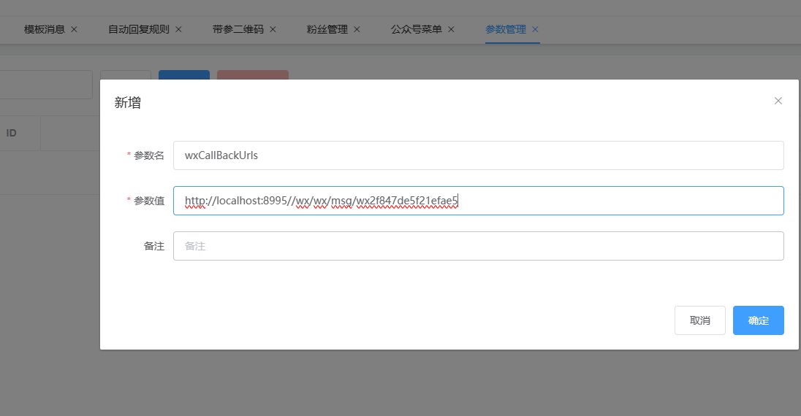

### 公众号管理系统
基于开源项目https://github.com/niefy/wx-manage fork而来
主要改为基于H2数据库，前端端打包在一起，方便部署。

默认访问地址号： http://localhost:8088/wx/index.html
默认账号密码： admin/admin
账号：admin
密码：123456

## 用处
在微信公众号配了api后，配置菜单，自动回复等会失效。这个时候可以通过这个来配置。
如果有问题，请自行修改。仅供参考方案。
ps: 源程序没有人维护了，存在一些bug，本项目也没有修复，凑合着用吧。

本系统的服务器地址(URL)
https://域名/wx/wx/msg/appid

## 转发到其他系统

默认情况下只有一个接受微信回调的地址，如果其他系统也需要回调用来处理业务，可以通过转发的方式实现。
配置如下方式

参数名固定： wxCallBackUrls 
参数值: http://localhost:8995/tduck-api/wx/mp/portal/wx2f847de5f21efae5 (ip+固定+appid)如果有多个地址，请用逗号分隔
